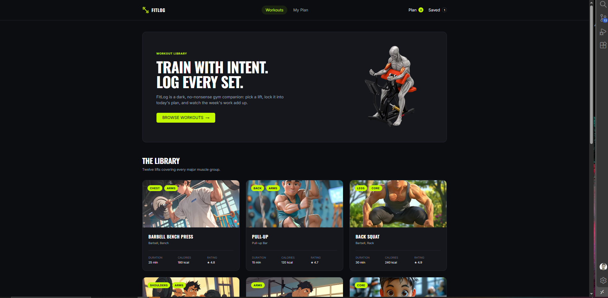

# 🏋️ FitLog — Workout Library

FitLog is a responsive workout library and daily workout planning web application built with Next.js, React, TypeScript, and Tailwind CSS.

Users can browse workouts from a REST API, view detailed workout information, add exercises to today's plan, save workouts for later, and manage selected workouts from the My Plan page.

The project follows a dark, gym-focused interface with a lime accent color and responsive layouts for desktop, tablet, and mobile devices.

---

## 📸 Screenshot



---

## 🛠️ Technologies

<p align="left">
  
</p>

* Next.js
* React
* TypeScript
* Tailwind CSS
* Next.js App Router
* REST API
* Browser LocalStorage
* Git & GitHub

---

## ✨ Features

### 1. Workout Library

* Fetches workout data from the FitLog REST API.
* Displays workout images, muscle groups, equipment, duration, calories, and ratings.
* Responsive workout card grid for desktop, tablet, and mobile.
* Each workout card links to its detailed workout page.

### 2. Workout Details

* Uses a dynamic route for each workout.
* Displays workout description, equipment, difficulty, sets, reps, duration, calories, and rating.
* Shows four workout instruction steps.
* Allows users to add a workout to today's plan.
* Allows users to save a workout for later.
* Prevents adding more workouts when today's plan reaches five items.

### 3. Today's Plan

* Users can add workouts to today's plan.
* Today's plan has a maximum limit of five workouts.
* Displays total exercises, minutes, and calories.
* Users can mark workouts as done.
* Users can remove workouts from today's plan.
* Plan changes are reflected in the navbar counter.

### 4. Saved Workouts

* Users can save workouts for later.
* Saved workouts are available from the My Plan page.
* Users can remove saved workouts.
* Saved count updates automatically in the navbar.

### 5. Live Navbar Counters

* Displays the current number of workouts in today's plan.
* Displays the current number of saved workouts.
* Plan and Saved counters update when data changes.
* Both counters link to the My Plan page.

### 6. Sorting

The My Plan page supports sorting workouts by:

* Duration
* Calories
* Rating

### 7. Responsive Design

* Responsive layout for desktop, tablet, and mobile devices.
* Responsive workout card grid.
* Responsive workout details page.
* Responsive My Plan cards and action buttons.
* Prevents horizontal overflow on smaller screens.

### 8. Persistent Browser Storage

* Today's Plan data is stored in browser LocalStorage.
* Saved workout data is stored in browser LocalStorage.
* Selected workouts remain available after refreshing the page.

### 9. Custom 404 Page

* Includes a custom FitLog 404 page.
* Shows a workout-not-found message.
* Provides a button to return to the workout library.

### 10. User Feedback

* Toast notifications appear after important actions.
* Users receive feedback when adding workouts.
* Users receive feedback when saving workouts.
* Users receive feedback when removing workouts.
* Users receive feedback when marking workouts as done.

---

## 📦 Dependencies

The project dependencies are managed through `package.json`.

Main dependencies and development tools include:

* Next.js
* React
* React DOM
* TypeScript
* Tailwind CSS
* ESLint

Install all dependencies with:

```bash
npm install
```

---

## 🚀 Getting Started

Follow these steps to run the project locally.

### 1. Clone the repository

```bash
git clone https://github.com/Emransani01/fit-log.git
```

### 2. Navigate to the project directory

```bash
cd fit-log
```

### 3. Install dependencies

```bash
npm install
```

### 4. Run the development server

```bash
npm run dev
```

### 5. Open the project

After starting the development server, open:

```text
http://localhost:3000
```

---

## 🌐 Live Demo

[View FitLog Live](https://fit-log-nu-one.vercel.app/)

---

## 🔗 Relevant Links

* [Live Website](https://fit-log-nu-one.vercel.app/)
* [GitHub Repository](https://github.com/Emransani01/fit-log)
